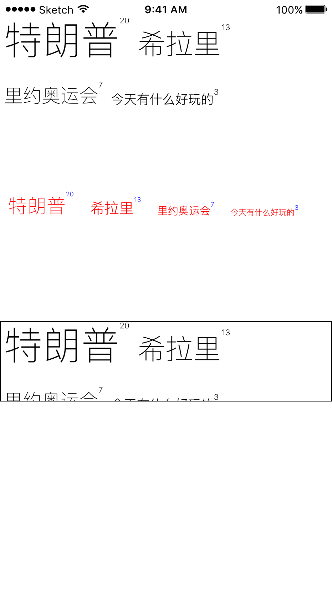

# PFTagView

Just a tag view like the wordpress tag-cloud.

## Screenshot



## Installation

### Using Carthage

To be written.

### Using CocoaPods

To be written.

### Manually

Drag `Classes` folder to your project.

## Usage 

### Get Started

```objective-c
#import 'PFTagViewList.h'

...

	// where you want to load this tag view
	PFTagViewConfiguration *config = [PFTagViewConfiguration new];
	PFTagViewList *view = [[PFTagViewList alloc] initWithFrame:frame
                                                          dict:dict
                                                        config:config];
...

@end

```

### Configuration

```objective-c
#import 'PFTagViewList.h'

...

	// where you want to load this tag view
	PFTagViewConfiguration *config = [PFTagViewConfiguration new];
	config.tagViewCountLabelTextColor = [UIColor blueColor];
    config.tagViewCountLabelFontSize = 8.f;
    config.tagViewMainTextColor = [UIColor redColor];
    config.maxFontSize = 24.f;
    config.minFontSize = 10.f;
    config.tagViewHeight = 30.f;
    config.tagViewMargin = 10.f;
	PFTagViewList *view = [[PFTagViewList alloc] initWithFrame:frame
                                                          dict:dict
                                                        config:config];
...

@end

```

## License

This project is released under the terms and conditions of the [MIT license](https://opensource.org/licenses/MIT). See [LICENSE](LICENSE) for details.
